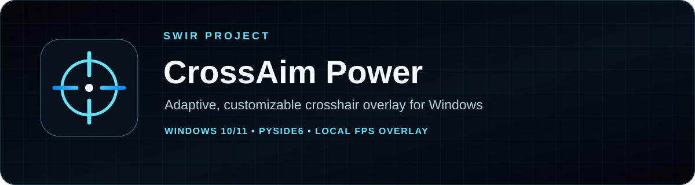
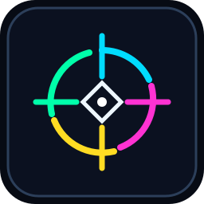
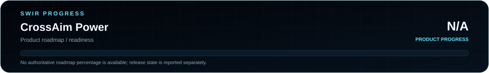

<!-- SWIR-README-STANDARD:v2 -->

<div align="center">



<br>




[**Highlights**](#-highlights) · [**Quick Start**](#-quick-start) · [**Controls**](#-controls) · [**Releases**](#-releases)

</div>

# CrossAim Power

**Adaptive, customizable crosshair overlay for Windows and FPS games.**



Product progress: **N/A**. The repository has a released v1.3.0 build, but no authoritative measurable product-completion roadmap; documentation status is not used as a readiness score.

## 📍 Project Status

| Item | Status |
|---|---|
| Current stage | Released Windows utility |
| Platform | Windows 10 / 11 |
| Latest public release | [v1.3.0](https://github.com/Swir/CrossAim_power/releases/tag/v1.3.0) |
| Product progress | N/A — see [`docs/STATUS.md`](docs/STATUS.md) |
| License | MIT |

## 🚀 Overview

CrossAim Power is a local PySide6 desktop utility that draws a click-through crosshair overlay and can adapt its reticle color to the pixels around the center of the selected display. It provides preset and custom reticles, multi-monitor placement, persistent settings and an editor without reading game memory or automating aim.

## 🆕 v1.3.0

- **Game Visibility Watchdog** periodically re-asserts native Win32 TOPMOST without stealing focus.
- Re-applies layered, click-through, tool-window and no-activate overlay styles.
- Detects the foreground application's executable and fullscreen-sized windows.
- Can automatically move the reticle to the monitor used by a fullscreen game.
- Adds **Re-assert overlay now** for instant recovery after a game changes display mode.
- Configurable compatibility refresh interval from 50–1000 ms.
- For true Exclusive Fullscreen, use Fullscreen Windowed / Borderless if the desktop overlay is still hidden.

## ✨ Highlights

| Feature | What it does |
|---|---|
| 🎯 Adaptive reticle | Power Smart Contrast scores surrounding screen zones and selects a visible reticle color |
| 🖥️ Multi-monitor placement | Selects a display and centers the overlay on that monitor |
| 🧩 Reticle editor | Edits a 32×32 matrix and supports built-in shapes and presets |
| 💾 Persistent layout | Saves reticle, monitor, window geometry and splitter state |
| 🪟 Windows overlay | Transparent click-through overlay with native TOPMOST watchdog for game visibility |
| ⌨️ Fast controls | F8 toggles the overlay; optional RMB hold temporarily hides it |

## ⚙️ Quick Start

### Recommended — Windows release

Download the verified v1.3.0 assets from [GitHub Releases](https://github.com/Swir/CrossAim_power/releases/tag/v1.3.0). The release includes `CrossAim_Power.exe` and a Windows ZIP package.

### From source

```bash
git clone https://github.com/Swir/CrossAim_power.git
cd CrossAim_power
py -m pip install -r requirements.txt
py crossaim_power_v13.py
```

`run.bat` provides the repository's Windows convenience launcher.

## 📋 Requirements / Compatibility

- Windows 10 or Windows 11.
- Python 3.10+ when running from source.
- PySide6 6.7+, MSS 9.0+ and Pillow 12.0+ as declared in `requirements.txt`.
- Borderless / fullscreen-windowed mode is generally the most reliable way to keep a normal desktop overlay visible above a game.

## 🎮 Controls

| Control | Action |
|---|---|
| `F8` | Show / hide the overlay |
| Hold `RMB` | Temporarily hide the overlay when enabled |
| `Ctrl + Alt + Arrow` | Move by 1 pixel |
| `Ctrl + Alt + Shift + Arrow` | Move by 10 pixels |

## 🧠 Technology / Architecture

| Layer | Technology / role |
|---|---|
| Desktop UI | Python + PySide6 |
| Screen sampling | MSS |
| Windows overlay behavior | Qt window flags + Win32 APIs |
| Packaging | PyInstaller workflow / repository build script |

The v1.2 entry point extends the existing v1.1 responsive UI while reusing the original overlay and adaptive-color core.

## 🔐 Privacy, Fair Play & Limitations

CrossAim Power runs locally and does not require an account or cloud service. Its current source implements a visual overlay and screen-pixel sampling; it does not read/write CS2 process memory, inject DLLs, inspect entity/player data, control recoil, automate aiming or fire weapons.

Game, anti-cheat and tournament rules vary. A visual overlay can still be disallowed by a particular platform, so check the rules that apply to your environment.

## 🗺️ Roadmap / Progress

The repository does not currently maintain an authoritative measurable product roadmap. Product progress therefore remains **N/A** rather than inventing a completion percentage.

[**Open status →**](docs/STATUS.md)

## 📦 Releases

Latest verified public release: **v1.3.0**, published with a Windows EXE and ZIP package.

[**GitHub Releases →**](https://github.com/Swir/CrossAim_power/releases)

## 🔎 Search Keywords

`windows crosshair overlay` • `adaptive crosshair windows` • `custom reticle overlay` • `fps crosshair tool` • `PySide6 crosshair` • `multi monitor crosshair` • `smart contrast reticle` • `CS2 visual overlay` • `custom crosshair editor` • `click through overlay windows` • `local gaming overlay` • `Windows reticle utility`

<div align="center">

### `AIM • ADAPT • CUSTOMIZE • PLAY`

⭐ **If this project is useful, consider leaving a star.**

[**← SWIR profile**](https://github.com/Swir) · [**All projects →**](https://github.com/Swir?tab=repositories)

</div>
