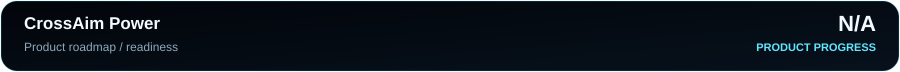

# CrossAim Power — Project Status

| Item | Status |
|---|---|
| Product progress | **N/A** — no authoritative measurable product roadmap is maintained |
| Latest public release | **v1.2.0** |
| Progress source | [`progress.json`](progress.json) |
| Documentation standard | SWIR README PRO v2 + SWIR Progress SVG PRO |

The N/A value is intentional. Documentation migration and the existence of a public release are not used as a proxy for product completion or future readiness.
